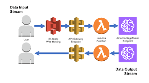

# Stock Price Prediction using AWS Services




## Project Directory Structure

```bash
├── .idea/  # Project settings and configurations (PyCharm)
├── venv/ # Virtual environment for Python dependencies
├── lambda_function.py # AWS Lambda function code 
├── README.md # Project documentation 
├── requirement.txt # List of required Python packages
└── Sagemaker_xgb_Stock_Price_Prediction.ipynb # Jupyter Notebook for SageMaker model training and deployment
``` 

## AWS Services Used
1. **Amazon SageMaker** - Train and deploy the machine learning model.
2. **AWS Lambda** - Invoke the deployed SageMaker endpoint for predictions and send notifications.
3. **Amazon SNS** - Send notifications after each prediction.
4. **Amazon API Gateway** - Expose the Lambda function as a REST API.
5. **Amazon S3** - Store training data and model artifacts.


## How to Use the Project

### 1. SageMaker Model
- Open the Jupyter Notebook `Sagemaker_xgb_Stock_Price_Prediction.ipynb`.
- Follow the steps to load data, train the XGBoost model, and deploy the model as an endpoint.
- The model will be exposed as a REST endpoint for inference.

### 2. Lambda Function
- The `lambda_function.py` file contains the AWS Lambda code to interact with the SageMaker model.
- It takes the input, sends it to the SageMaker endpoint, and retrieves predictions.
- The function also sends an SNS notification with the prediction result.

### 3. S3 Usage
- Use an S3 bucket to store your training data and model artifacts.
- You can customize your bucket name in the SageMaker notebook and Lambda function.
- Example S3 bucket path: `s3://your-bucket-name/`.

### 4. SNS Integration
- SNS is configured to send a notification (email or SMS) once a prediction is made.
- Make sure to subscribe to the SNS topic in your AWS console.
- Example SNS Topic ARN: `arn:aws:sns:region:account-id:MyTopic`.

### 5. API Gateway
- API Gateway exposes your Lambda function as a REST API for external access.
- After setting up API Gateway, you can send HTTP requests to interact with the deployed SageMaker model via the Lambda function.

---
